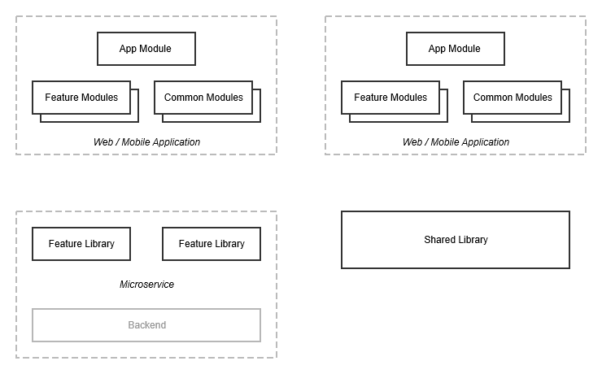
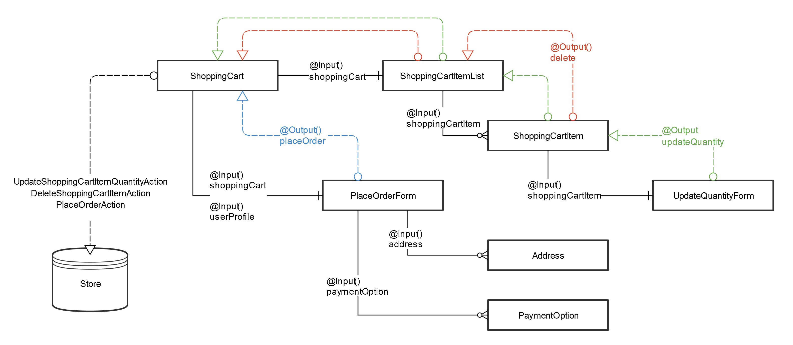
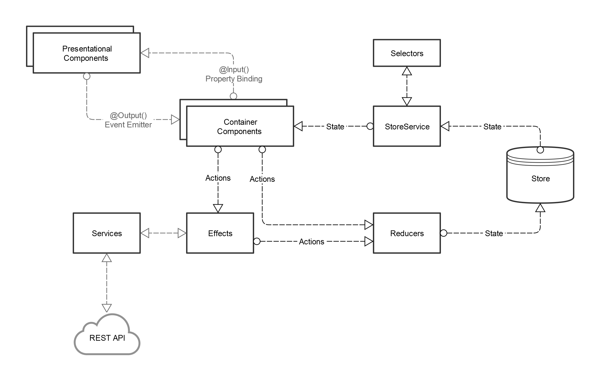

# @ngxp demo

## Architecture Overview
The basic building blocks of this architecture blueprint are web and/or mobile applications, feature libraries and standalone shared libraries.



### Feature Library
A feature library is the glue between a feature provided by a microservice and the consuming web or mobile application. It exposes the functionality of that service in form of injectable services or even complete UI components. It is built by same team that maintains the rest of the microservice.

### Shared Library
A shared library contains features that are not directly related to the business features provided by microservices. These may be general-purpose UI elements, helper functions, wrapper for third-party libraries, etc.

### Web / Mobile Application
Web or mobile appliations are the consumers of feature libraries and shared libraries and combine these with application-specific features to build the deployable artefact that is used by the end user. The application itself consists of feature modules and common modules. Feature modules implement the business requirements of the application which are not provided via feature librarys. Common modules are the application-specific equivalent of shared libraries and contain code that is shared among the various feature modules but is specific to the application.

## Modularization
This section describes the technical foundation of the artefacts described in the architecture overview. 

### Repositories and Workspaces
The repositories for applications and libraries should reflect the organizational boundaries of the teams implementing them. Following the idea that each microservice has its own dedicated team this means that all feature libraries of a microservice should be managed within the repository of that microservice. The same applies to shared libaries and the applications which all have their dedicated repository.

Each repository contains a workspace created with [Angular CLI](https://cli.angular.io/) and [Nx Workspace](https://nrwl.io/nx).

### Application Workspace
Applications are kept modularized by separating features out into dedicated modules via Nx' `ng generate lib` command. The root app module should be as lean as possible and mostly contain code for configuring and setting up the application as well as orchestrating the feature modules. 

The following examples illustrates the module structure for a simple shop application.

```
project root
├─ apps
│  └─ my-shop
├─ libs
│  ├─ common-ui
│  ├─ homepage
│  ├─ orders
│  ├─ order-common
│  ├─ products
│  ├─ products-common
│  ├─ shopping-cart
│  ├─ shopping-cart-common
│  ├─ user-profile
│  └─ user-profile-common
```

The `my-shop` app module provides the application frame including basic UI and configuration and otherwise delegates to lazy-loaded feature modules for implementing the actual features of the app.

#### App Module
The app module is the entry-point for Angular's bootstrapper and configures application-wide modules. Via the routing configuration, the app module defines which feature modules are loaded while the user navigates through the application.

```ts
// app.component.ts
@NgModule({
…
    imports: [
        RouterModule.forRoot([
            { path: '', loadChildren: () => import('@ngxp/homepage').then(m => m.HomepageModule) },
            { path: 'products', loadChildren: () => import('@ngxp/products').then(m => m.ProductsModule) },
            { path: 'shopping-cart', loadChildren: () => import('@ngxp/shopping-cart').then(m => m.ShoppingCartModule) },
            { path: 'user-profile', loadChildren: () => import('@ngxp/user-profile').then(m => m.UserProfileModule) },
            { path: 'orders', loadChildren: () => import('@ngxp/orders').then(m => m.OrdersModule) }
        ]),
    ]
…
})
export class AppModule { }
```

The root component of the application defines the basic shell of the application and otherwise delegates to the components wired up via the routing configuration.

```html
<!-- app.component.html -->
<ngxp-navbar></ngxp-navbar>

<main class="container">
    <router-outlet></router-outlet>
</main>
```

#### Feature Modules
Feature modules expose their API through a file called `index.ts` within the `src` directory. Other modules may only import what is exposed through this file.

```
project root
├─ libs
│  ├─ homepage
│  │  ├─ src
│  │  │  ├─ lib
│  │  │  │  ├─ homepage
│  │  │  │  │  └─ homepage.component.ts
│  │  │  │  └─ homepage.module.ts
│  │  │  └─ index.ts
```

The homepage feature module for example only exports the `HomepageModule` that is used in the `AppModule`'s routing configuration. The `HomepageComponent` is not directly referenceable by other modules.

```ts
// index.ts
export { HomepageModule } from './lib/homepage.module';
```

#### Common Modules

As the name suggests, lazy-loaded feature modules are only loaded when the user navigates to the route for which the module is configured. That's why it is recommended to place features, that are used by other modules, into separate modules.^

In the following example, the `homepage` feature modules uses the `ngxp-product-search` component. If that component was put in the `products` feature module, the whole module would be loaded when rendering the `homepage` component even if the user never navigates to a view of the `products` feature module.

```html
<!-- homepage.component.html -->
<h1 class="mb-5">Welcome</h1>

<ngxp-product-search-form  (search)="onProductSearch($event)"></ngxp-product-search-form>
```

Instead, the component is provided by the `products-common` module...

```
project root
├─ libs
│  ├─ products-common
│  │  ├─ src
│  │  │  ├─ lib
│  │  │  │  ├─ product-search-form
│  │  │  │  │  └─ product-search-form.component.ts
│  │  │  │  └─ products-common.module.ts
│  │  │  └─ index.ts
```

```ts
// index.ts
export { ProductsCommonModule } from './lib/products-common.module';
export * from './lib/product-search-form/product-search-form.component';
```

```ts
// products-common.module.ts
@NgModule({
…
    declarations: [
        ProductSearchFormComponent
    ],
    exports: [
        ProductSearchFormComponent
    ]
…
})
export class ProductsCommonModule {}
```

.. which is imported in the `homepage` module's configuration.

```ts
// homepage.module.ts
import { ProductsCommonModule } from '@ngxp/products-common';

@NgModule({
…
    imports: [
        ProductsCommonModule
    ]
…
})
export class HomepageModule { }
```

#### Importing Feature/Common Modules
When importing feature or common modules instead of using a relative path, a package name is used.

```ts
// homepage.module.ts
import { ProductsCommonModule } from '@ngxp/products-common';
```

This is done using the `paths` compiler option of TypeScript. The global `tsconfig.json` contains a mapping between package names and local paths. Mappings are automatically added when generating a new libary via Nx.

```json
// tsconfig.js
{
…
  "compilerOptions": {
    "paths": {
      "@ngxp/products-common": [
        "libs/products-common/src/index.ts"
      ]
    }
  }
…
}

```

This means that libraries that were developed within an application workspace can evolve into shared libraries that are used across multiple applications in the future.


### Feature/Shared Library Workspace
Within a microservice, all libraries should be maintained within a single workspace. Shared libraries get their own dedicated workspace. The libraries within a workspace are generated with [Angular 6's library feature](https://github.com/angular/angular-cli/wiki/stories-create-library). In addition to the libraries, each workspace also contains an example application that is used for developing, testing and documenting the libaries.

The workspace of a library is structured like a regular application workspace.

```
project root
├─ apps
│  └─ example-app
├─ libs
│  ├─ feature-a
│  └─ feature-b
```

However, in contrast to feature and common modules in an application, each library in a library workspace is created with the `--publishable` option of the `ng generate lib`.  This adds a `package.json` file as well as a [ng-packagr](https://github.com/dherges/ng-packagr) configuration file called `ng-package.json` to the libary's directory. 

```
project root
├─ libs
│  └─ feature-a
│     ├─ src
│     ├─ ng-package.json
│     └─ package.json
```

The libaries can then be versioned and published individually by using the `npm version` and `npm publish` commands respectively. The versioning scheme should follow the guidelines of [Semantic Versioning](https://semver.org/).

**Further Reading**
* [Why is a workspace (or monorepo) needed?](https://nrwl.io/nx/why-a-workspace)
* [Nx Workspaces: Learn how to create an Nx Workspace, add apps and libs, and serve and build apps within it ](https://angularplaybook.com/p/nx-workspaces)
* [Angular 6 – Angular CLI Workspaces](https://theinfogrid.com/tech/developers/angular/angular-6-angular-cli-workspaces/)
* [Announcing Nrwl Nx 6.0](https://blog.nrwl.io/announcing-nrwl-nx-6-0-29b963d87d8e)
* [The Angular Library Series - Creating a Library with the Angular CLI](https://blog.angularindepth.com/creating-a-library-in-angular-6-87799552e7e5)
* [Angular Application Architecture: npm Packages, Monorepos and Microservices](https://speakerdeck.com/manfredsteyer/angular-application-architecture-npm-packages-monorepos-and-microservices-nghamburg-march-2018)
* [A software architect's approach towards using Angular (and SPAs in general) for microservices aka microfrontends](https://www.softwarearchitekt.at/post/2017/12/28/a-software-architect-s-approach-towards-using-angular-and-spas-in-general-for-microservices-aka-microfrontends.aspx)


# Components
An Angular application is made up of nested components that build a component tree. Over time, these components often tend to grow in complexity and size. To keep components maintainable, it is recommended to follow a couple of guidelines.

### Keep Components small
Components often start small, but when additional features are added over time, they grow and do more than one thing. Preventing this by splitting up the component early and enforcing the Single Responsibility Principle not only leads to more maintainable code but also promotes reusability, improves testability and leads to a more readable code.

Compare these two implementations of a shopping cart. While doing the same thing(s), the first one contains code for displaying the list of shopping cart items as well as the form for placing the order, the second one delegates both those features to separate components thus greatly improving the code quality. The same applies to the corresponding component classes, stylesheets and tests.

```html
<h1 class="mb-5">Shopping Cart</h1>

<table class="table table-hover" *ngIf="shoppingCart">
    <thead>
        <tr>
            <th>Item</th>
            <th>Price</th>
            <th>Quantity</th>
            <th></th>
        </tr>
    </thead>
    <tbody>
        <tr
            *ngFor="let shoppingCartItem of shoppingCart.items"
            (updateQuantity)="onUpdateQuantity($event)"
            (delete)="onDelete($event)"
        >
            <td>
                <a href="" class="name">{{ shoppingCartItem.name }}</a><br />
                <small class="description">{{ shoppingCartItem.description }}</small>
            </td>
            <td class="text-right price">{{ shoppingCartItem.price | number:'1.2' }}</td>
            <td style="width: 15%">
                <ngxp-update-quantity-form
                    [shoppingCartItem]="shoppingCartItem"
                    (updateQuantity)="onUpdateQuantity($event)"
                ></ngxp-update-quantity-form>
            </td>
            <td>
                <button type="submit" class="btn btn-danger remove" (click)="onDelete()">Remove</button>
            </td>        
        </tr>
    </tbody>
    <tfoot>
        <tr>
            <td colspan="2" class="text-right total-price">{{ shoppingCart.totalPrice | number:'1.2' }}</td>
            <td colspan="2"></td>
        </tr>
    </tfoot>
</table>

<form class="mt-5 row align-items-start" [formGroup]="form" (submit)="onSubmit($event)">
    <h2 class="col-12 h3 mb-4">Place Order</h2>

    <div class="form-group col-4 billing-address">
        <label class="form-control-label h6 mb-3" for="billingAddress">Billing Address</label>

        <div class="form-check mb-3" *ngFor="let address of addresses; let i = index">
            <input class="form-check-input" type="radio" formControlName="billingAddress" id="billingAddress-{{ i }}" [value]="address" />
            <label class="form-check-label" for="billingAddress-{{ i }}">
                <ngxp-address [address]="address"></ngxp-address>
            </label>
        </div>
    </div>

    <div class="form-group col-4 shipping-address">
        <label class="form-control-label h6 mb-3" for="shippingAddress">Shipping Address</label>

        <div class="form-check mb-3" *ngFor="let address of addresses; let i = index">
            <input class="form-check-input" type="radio" formControlName="shippingAddress" id="shippingAddress-{{ i }}" [value]="address" />
            <label class="form-check-label" for="shippingAddress-{{ i }}">
                <ngxp-address [address]="address"></ngxp-address>
            </label>
        </div>
    </div>

    <div class="form-group col-2 payment">
        <label class="form-control-label h6 mb-3" for="payment">Payment</label>

        <div class="form-check mb-3" *ngFor="let paymentOption of paymentOptions; let i = index">
            <input class="form-check-input" type="radio" formControlName="payment" id="payment-{{ i }}" [value]="paymentOption" />
            <label class="form-check-label" for="payment-{{ i }}">
                <ngxp-payment-option [paymentOption]="paymentOption"></ngxp-payment-option>
            </label>
        </div>
    </div>

    <div class="form-group col-2 text-right">
        <button type="submit" class="btn btn-primary">Place Order</button>
    </div>
</form>
```

```html
<h1 class="mb-5">Shopping Cart</h1>

<ngxp-shopping-cart-item-list
    [shoppingCart]="shoppingCart$ | async"
    (updateQuantity)="onUpdateQuantity($event)"
    (delete)="onDelete($event)"
></ngxp-shopping-cart-item-list>

<ngxp-place-order-form
    [shoppingCart]="shoppingCart$ | async"
    [userProfile]="userProfile$ | async"
    (placeOrder)="onPlaceOrder($event)"
    *ngIf="!((shoppingCart$ | async) | shoppingCartIsEmpty)"
></ngxp-place-order-form>
```

Components can also be reduced in size by extracting the logic within them into separate functions.

### Keep business logic out of Components
Business logic in components is hard to test and prevents reuse in other parts of the application. In many cases, it is not necessary to bind this code to the component. Instead, it can be extracted into easy-to-use and easy-to-test functions and then be used not only in the component itself but also in all other parts of the application.

#### Move Business Logic into Functions

Moving even simple logic into separate functions provides a couple of benefits.

* Functions that are free of any Angular-specific dependencies are easy to test as not testing module has to be initialized.
* The component itself can be unit-tested without going into all the specifics of the business logic.
* Instead of being bound to a component, the logic can now be used in all kinds of contexts (e.g. NgRx reducers, effects and selectors, services, RxJS streams and templates (see below)) and it can also be easily changed for the whole application.
* By separating the logic from any Angular-specific dependencies, they may be moved in to shared libraries which can also be used in non-Angular projects.
* The function is not bound to how the data is retrieved.

```ts
// shopping-cart.util.ts
export function shoppingCartIsEmpty(shoppingCart: ShoppingCart) {
    if (isNull(shoppingCart)) {
        return true;
    }

    return isEmpty(shoppingCart.items);
}
```

#### Move (Business) Logic into Pipes

An often-overlooked option is to move component logic that prepares data for usage in templates (e.g. extracting values, mapping data into another form, filtering) into Angular Pipes. Pipes are easy to create, easy to test and do not need an Angular context to be tested.

This approach can also be combined with moving business logic into functions as described above. By wrapping the function in a pipe, it can easily be used within templates.

```ts
// shopping-cart-is-empty.pipe.ts
@Pipe({
    name: 'shoppingCartIsEmpty'
})
export class ShoppingCartIsEmptyPipe extends FunctionPipe {
    constructor() {
        super(shoppingCartIsEmpty);
    }
}
```

```html
<!-- shopping-cart.component.html -->
<ngxp-place-order-form
    …
    *ngIf="!(shoppingCart | shoppingCartIsEmpty)"
></ngxp-place-order-form>

```

The example uses a base class for wrapping functions in pipes.

```ts
// function.pipe.ts
export abstract class FunctionPipe implements PipeTransform {

    constructor(
        private fn: (...args) => any
    ) { }

    transform(...args) {
        return this.fn(...args);
    }
}
```

#### Move Business Logic into NgRx Selectors

NgRx Selectors can be used to transform or filter data into the form that the component needs. This has the nice side-effect, that the component is less dependent on how the actual data looks like.

In the following example the `UserProfileComponent` renders the addresses and payment options of the current user. Instead of retrieving the user profile and then extracting the needed data from the object, this logic is delegated to the selectors.

```ts
// user-profile.component.ts
export class UserProfileComponent {
    addresses: Observable<Address[]>;
    paymentOptions: Observable<PaymentOption[]>;

    constructor(
        private store: Store<UserProfileAppState>
    ) {
        this.addresses = this.store.select(selectAddresses);
        this.paymentOptions = this.store.select(selectPaymentOptions);
    }
}
```

Notice that the selectors also take care of the case in which the user profile is not loaded yet (and evaluates to null).

```ts
// user-profile.selectors.ts
const selectUserProfileState = createFeatureSelector<UserProfileState>(USER_PROFILE_FEATURE_KEY);

export const selectUserProfile = createSelector(
    selectUserProfileState,
    state => state.userProfile
);

export const selectAddresses = createSelector(
    selectUserProfile,
    userProfile => isNull(userProfile) ? [] : userProfile.addresses
);

export const selectPaymentOptions = createSelector(
    selectUserProfile,
    userProfile => isNull(userProfile) ? [] : userProfile.paymentOptions
);
```

### Keep Components stateless
Components should be kept as stateless as possible, especially in regards to business data. Components that receive their data via `Input()` properties should not mutate this data. Instead they should communicate any data changes via events and wait for their input bindings to provide the updated data. Similarly, components that have a dependency on the NgRx store should dispatch actions to inform the application about state changes.

There are cases where it makes sense that a component manages its own state, but these cases should be the exception rather than the rule and mostly apply to UI state.

### Differentiate between Presentational and Container Components
While defining components, it is helpful to distinguish between presentational and container components. 

Returning to the shopping cart example, the `ShoppingCartComponent` acts as a container component that uses a number of presentational components to render the shopping cart: `ShoppingCartItemList`, `ShoppingCartItem`, `UpdateQuantityForm`, `PlaceOrderForm`, `Address` and `PaymentOption`.



#### Presentational Components
Presentational components are concerned with how things look. They should work similar to pure functions in functional programming: As long as you provide them with the same properties (via their `@Input` bindings), they should render the same markup. They are kept as stateless as possible and should not have dependencies on application-wide business services or the NgRx store. Instead, they emit events which are then handled by higher-up container components.

#### Container Components
Container components are concerned with how things work by combining presentational components and wiring them up with the rest of the application. They know about the application state via the NgRx store, business services and the routing and pass the data they receive from those sources to presentational child components. They also listen to the events the presentational components emit and act upon them, for example by dispatching actions. Container components are often the components that are referenced in the routing configuration, but may also appear in other places such as modal overlays.

**Further Reading**
* [Stateful and stateless components, the missing manual](https://toddmotto.com/stateful-stateless-components)
* [Angular Architecture: Smart Components vs Presentational Components](https://blog.angular-university.io/angular-2-smart-components-vs-presentation-components-whats-the-difference-when-to-use-each-and-why/)
* [Angular Architecture: Container vs Presentational Components Common Design Pitfalls](https://blog.angular-university.io/angular-component-design-how-to-avoid-custom-event-bubbling-and-extraneous-properties-in-the-local-component-tree/)


# State Management
State in a web application comes in a variety of forms and is often stored in different parts of the application. State may be the data that has been transferred from the server via REST endpoints but also data generated by the user that may be sent back to the backend at some point (or not). But application state also includes the router state or in form of internal state of UI components. 

While an application grows in size and complexity, it becomes increasingly difficult to manage its state. UI components may need to be informed about state changes to render accordingly. Bugs can be hard to fix when the cause for a state change is not clear. Asynchronous or failing operations may lead to inconsistent data. And often state has to be synchronized across different parts of the application.

NgRx has been developed to specifically meet these challenges by implementing a unidirectional data flow that keeps the application state in a centralized store. 



### Retrieving State
Components retrieve application state from the store directly using selectors. In both cases selector functions should process the state to the form in which the component requires it.

```ts
// user-profile.component.ts
export class UserProfileComponent {
    addresses: Observable<Address[]>;

    constructor(
        private store: Store<UserProfileAppState>
    ) {
        this.addresses = this.store.select(selectAddresses);
    }
}
```

The `UserProfileComponent` uses the `selectAddress` selector to retrieve the user's addresses from the application state. 

```ts
// user-profile.selectors.ts
const selectUserProfileState = createFeatureSelector<UserProfileState>(USER_PROFILE_FEATURE_KEY);

export const selectUserProfile = createSelector(
    selectUserProfileState,
    state => state.userProfile
);

export const selectAddresses = createSelector(
    selectUserProfile,
    userProfile => isNull(userProfile) ? [] : userProfile.addresses
);
```

Being pure functions, is is easy to build selectors that build upon each other promoting code reuse and avoiding duplication of logic. In the example `selectAddresses` selector delegates to the `selectUserProfile` selector to retrieve the user profile from the application state. It then returns the addresses from the user profile.

As illustrated by the example, selectors can also be used to provide default values, for example when data has not been loaded yet. By falling back to an empty array when the user profile is `null`, the selector provides the consuming component with a consistent data type and thus keeps the component implementation simple.

Using the `createFeatureSelector` and `createSelector` helpers functions of NgRx to create and combine selectors automatically memoizes the selector functions. This means, that the selector keeps track of the arguments with it was called the last time and remembers the value it has calculated and returned. As long as the selector is called with the same arguments, it will not recompute its return value and instead return the cached one.   

Apart from filtering and transforming state for consumption by components, selector functions are also an important abstraction layer over the structure of the store. The way data is organized within the store can easily be changed without affecting its consumers as long as the selector functions return the same data.

### Triggering State Changes
Application state may never be mutated directly. Instead, actions are dispatched which cause reducer functions to return an updated state which is then pushed to the observers of the store.

Actions are usually dispatched by container components as the result of user actions or other events, e.g. on load or destruction of a component.

```html
<!-- homepage.component.html -->
<h1 class="mb-5">Welcome</h1>
…
<ngxp-product-search-form  (search)="onProductSearch($event)"></ngxp-product-search-form>
```

```ts
// homepage.component.ts

export class HomepageComponent {
    constructor(
        private store: Store<void>
    ) {}

    onProductSearch(query: string) {
        this.store.dispatch(searchProductsAction({ query }));
    }
}
```

In the example the `HomepageComponent` handles the `search` event of the product search form and triggers a `searchProductsAction` with the search query as `payload`.

The actual state change happens in the reducer functions. When an action is dispatched, it is passed to each reducer along with the current state. Each reducer then decides whether to act upon the given action or not.

```ts
// products.reducer.ts

const reducer = createReducer(initialState,
    on(loadSearchResultsAction, (state, { query }) => ({
        ...state,
        query,
        searchResults: []
    })),
    on(searchResultsLoadedAction, (state, { searchResults }) => ({
        ...state,
        searchResults
    }))
);
```

The reducer in this example handles the `loadSearchResultsAction` and `searchResultsLoadedAction`. In case of the `loadSearchResultsAction`, the search query is stored in the state and any previous search results are reset.

The `searchProductsAction` from the previous example on the other hand would not cause a state change. Instead, the given state is returned untouched. This is an important aspect of reducers, as this means that the object identity only changes when there have been changes to the state. Combined with the `OnPush` change detection strategy, this greatly improves the application's performance.

### Triggering Side-Effects
Not all dispatched actions are handled directly by a reducer function. Actions can be used to trigger side-effects, for example asynchronous requests to the backend, triggering UI notifications or causing route changes. The result of those side-effects can lead to new actions which then trigger other effects or cause state changes via reducers.

```ts
// products.effects.ts

@Injectable()
export class ProductsEffects {

    loadSearchResults$ = createEffect(
        () => this.actions$.pipe(
            ofType(loadSearchResultsAction),
            switchMap(({ query }) => this.productService
                .searchProducts(query)
                .pipe(
                    map(searchResults => searchResultsLoadedAction({ searchResults }))
                )
            )
        )
    );

    constructor(
        private actions$: Actions,
        private productService: ProductService
    ) {}
}
```

The `loadSearchResultsAction` triggers a call of the `searchProducts` method of the `productService`. The results are returned asynchronously, leading to the dispatch of the `searchResultsLoadedAction`.

### Segmenting the Store by Modules
While there is only one store for the whole application, it is possible to define one or more reducers per module. That way, the structure of the store is aligned to the way the modules are organized within the application.

```ts
// products.module.ts

@NgModule({
    imports: [
…
        RouterModule.forChild([
            { path: '', pathMatch: 'full', component: SearchResultsComponent }
        ]),
        StoreModule.forFeature(PRODUCTS_FEATURE_KEY, productsReducer, { initialState: productsInitialState }),
        EffectsModule.forFeature([
            ProductsEffects,
            ProductsNavigationEffects
        ]),
…
    ],
…
    providers: [
        ProductsEffects,
        ProductsNavigationEffects
    ]
})
export class ProductsModule {}
```

Using the `forFeature` methods of the `StoreModule` and `EffectsModule`, each module can define its own set of reducers as well as effects. In case of lazy-loaded feature modules, the state is initialized as soon as the module is loaded.

### Store Encapsulation
Even when each module defines its own effects, reducers and application state interfaces, it all comes together in a central store instance. However, there may be situations when it is desirable to keep parts of the store internal to the module and only exposing a subset of actions to external modules.

Taking the shopping cart as an example, it is possible to add items to the shopping cart, change their quantity as well as removing them. However, changing the quantity and removing items are actions that should only be dispatched by components belonging to the `ShoppingCartModule`. The process of adding an item to the shopping cart on the other hand can be triggered by the `SearchResultsComponent` located in the `ProductsModule`.

Keeping actions private to a module is as simple as not exporting them in the `index.ts` of the module. Public actions on the other hand should not only be exported, by the module, but also need to be located in a Common Module which as Feature Modules are lazy-loaded and are probably not yet available when the action needs to be dispatched.

In the same spirit, access to the module state can be restricted. The `ShoppingCartComponent` needs to be able to retrieve the shopping cart from the application state. However, there is no need that any other component outside of the `ShoppingCartModule` has access to this part of the store. 

```
project root
├─ libs
│  ├─ shopping-cart
│  └─ shopping-cart-common
│     └─ src
│         ├─ lib
|         │  ├─ shopping-cart
|         │  │  └─ shopping-cart.component.ts
|         │  └─ state
|         │     ├─ shopping-cart.actions.ts
|         │     ├─ shopping-cart.reducer.ts
|         │     └─ shopping-cart.selectors.ts
│         └─ index.ts
│  └─ user-profile-common
│     └─ src
│         ├─ lib
|         │  └─ state
|         │     └─ shopping-cart-common.actions.ts
│         └─ index.ts
```

The `shopping-cart-common` feature module contains actions, a reducer (and therefore state interface) as well as selectors which are all required by the `ShoppingCartComponent`, but not by any external module. The action, that is publicly available is located in the common module.

```ts
// shopping-cart/src/index.ts

export { ShoppingCartModule } from './lib/shopping-cart.module';
```

```ts
// shopping-cart/src/lib/state/shopping-cart.actions.ts

export const loadShoppingCartAction = createAction(
    '[Shopping Cart] load shopping cart');

export const updateShoppingCartItemQuantityAction = createAction(
    '[Shopping Cart] update shopping cart item quantity',
    props<{ quantityUpdate: ResourceWith<QuantityUpdate> }>()
);

export const deleteShoppingCartItemAction = createAction(
    '[Shopping Cart] delete shopping cart item',
    props<{ shoppingCartItem: ShoppingCartItem }>()
);
```

The `shopping-cart` lib keeps its actions, reducer (and therefore state interface) and selectors private by not exposing them through the `index.ts`.

```ts
// shopping-cart-common/src/index.ts

export * from './lib/state/shopping-cart-common.actions';
```

```ts
// shopping-cart-common/src/lib/state/shopping-cart-common.actions.ts

export const addToShoppingCartAction = createAction(
    '[Shopping Cart] add to shopping cart',
    props<{ additionToShoppingCart: AdditionToShoppingCart }>()
);

export const shoppingCartLoadedAction = createAction(
    '[Shopping Cart] shopping cart loaded',
    props<{ shoppingCart: ShoppingCart }>()
);
```

The `shopping-cart-common` lib exports its `addToShoppingCartAction` and `shoppingCartLoadedAction` through the `index.ts`, making it possible to dispatch these actions in other modules.

```ts
// products/src/lib/search-results/search-results.component.ts

import { AdditionToShoppingCart, addToShoppingCartAction } from '@ngxp/shopping-cart-common';

export class SearchResultsComponent {
…
    onAddToShoppingCart(additionToShoppingCart: AdditionToShoppingCart) {
        this.store.dispatch(addToShoppingCartAction({ additionToShoppingCart }));
    }
…
}

```

**Further Reading**
* [Using NgRx 4 to Manage State in Angular Applications](https://blog.nrwl.io/using-ngrx-4-to-manage-state-in-angular-applications-64e7a1f84b7b)
* [NgRx: Selectors](https://ngrx.io/guide/store/selectors)
* [NgRx: Patterns and Techniques](https://blog.nrwl.io/ngrx-patterns-and-techniques-f46126e2b1e5)
* [Nx Guide: Setting Up NgRx](https://nrwl.io/nx/guide-setting-up-ngrx)

# Message Exchange between Modules
While effects can dispatch new actions, it is not mandatory that they do. This opens up the possibility to use actions as a way to publish application-wide events that can be used to decouple modules from each other.

```ts
// homepage.component.ts

export class HomepageComponent {
    constructor(
        private store: Store<void>
    ) {}

    onProductSearch(query: string) {
        this.store.dispatch(searchProductsAction({ query }));
    }
}
```

The `HomepageComponent` renders a product search form and dispatches a `searchProductsAction` on submit. However, it makes no assumptions on what "searching for a product" actually entails.

```ts
// app.effects.ts

export class AppEffects {

    navigateToProductSearchResults$ = createEffect(
        () => this.actions$.pipe(
            ofType(searchProductsAction),
            map(({ query }) => {
                this.router.navigate(
                    ['products'],
                    { queryParams: { query } }
                )
            })
        ),
        { dispatch: false }
    );

    constructor(
        private actions$: Actions,
        private router: Router
    ) {}
}
```

Instead the application itself acts upon that action by causing a route change to the `products` route which causes the `products` feature module to be loaded. Again, the `AppModule` does not make any assumptions on how a product search is performed and instead just delegates to `ProductsModule`.

```ts
// products-navigation.effects.ts

export class ProductsNavigationEffects {

    loadSearchResultsOnNavigate$ = createEffect(
        () => this.actions$.pipe(
        ofType(ROUTER_NAVIGATION),
        map((action: RouterNavigationAction) => action.payload),
        map(routerNavigationPayload => routerNavigationPayload.routerState),
        filter(routerState => routerState.url.startsWith('/products')),
        map(routerState => routerState.root.queryParams.query),
        map((query: string) => defaultTo(query, null)),
        map(query => loadSearchResultsAction({ query }))
    ));

}
```

Now within the `ProductsModule`, the `ProductsNavigationEffects` know that whenever the `products` route is activated, search results need to be loaded and the appropriate `loadSearchResultsAction` is dispatched.

The indirection via the router is used for two reasons:

1. By handling the `searchProductsAction` in the `AppEffects` any module can dispatch the action while the effects of the `ProductsModule` may not have been loaded yet as the module is lazy-loaded.

2. From the perspective of the `ProductsModule`, the activation of the `products` route is the trigger for a product search. This means that `loadSearchResultsAction` is also dispatched when the route is activated by other means than the dispatch of the `searchProductsAction`, e.g. reloading the page or opening a bookmark.

# Centralized Styling
- tbd

**Further Reading**
* [Audi CI](https://www.audi.com/ci/en/guides/user-interface/components.html)

# Future-proofing
- Creating Facades for Third-Party Libraries
- Reducing Angular Dependencies
- Wrapping Functionality in Angular Elements

**Further Reading**
* [Angular Elements Overview](https://angular.io/guide/elements)
* [A Practical Guide to Angular Elements](https://nitayneeman.com/posts/a-practical-guide-to-angular-elements/)
* [Micro Apps with Web Components using Angular Elements ](https://www.softwarearchitekt.at/post/2018/05/04/microservice-clients-with-web-components-using-angular-elements-dreams-of-the-near-future.aspx)
* [Export Angular components as Custom Elements with “Angular Elements”](https://medium.com/vincent-ogloblinsky/export-angular-components-as-custom-elements-with-angular-elements-a2a0bfcd7f8a)
* [Lessons Learned, making our app with Web Components](https://medium.com/samsung-internet-dev/lessons-learned-making-our-app-with-web-components-bf55379cfcda)
